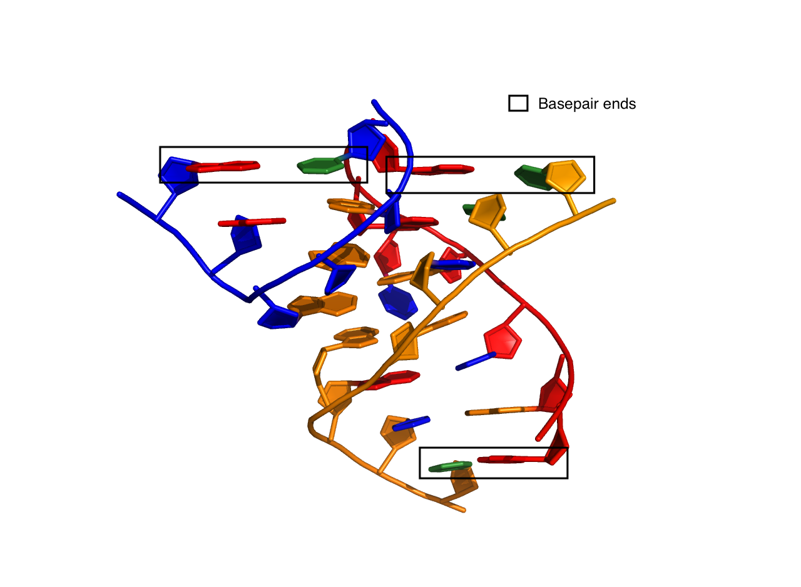
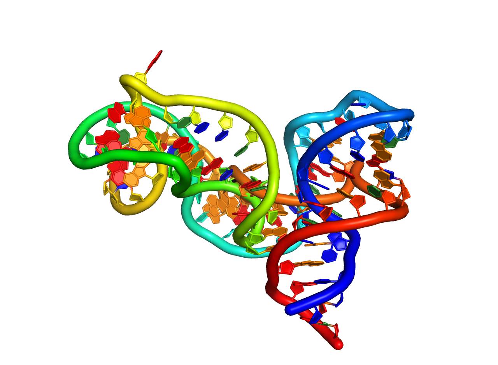

RNAMake
=======

**RNAMake** is a toolkit for designing and optimizing RNA 3D structure. It allows 
the alignment between RNA motifs. These motif are small modular peices of RNA that are 
believed to fold independently, thus attaching them together with helix flanking both 
sides allows users of **RNAMake** to build large segments of RNA with a high success 
rate of forming the predicted structure in vitro.

Install
-------

```bash
git clone https://github.com/jyesselm/RNAMake.git
cd RNAMake
sudo pip install -r requirements.txt
```

To install call
```
python setup.py 
```

Compile
------- 

to compile, make sure you have `cmake` and `ninja` installed with their binaries set up in your `$PATH`. Then run:
```
python compile.py 
```


Tests
-----
To run unit tests for python:
```
RNAMake/rnamake/unittests/run_unittests.sh
```

To run unit tests for C++ code:
```
cd RNAMAke/rnamake/lib/RNAMake/cmake/build/
python run_unittests.py
```


Applications
============

design_rna
-----------
Generates segments are RNA between two Waston-Crick basepairs can also perform sequence optimization for helical sequences. 

```
design_rna  [-pdb pdb_file.pdb ]
			[-start_bp "start_bp_name" ]
			[-end_bp "end_bp_name" ]
			[-mg motif_graph.mg ]
			[-out_file name_of_outfile.out ]
			[-score_file name_of_scorefile.scores ]
			[-designs num_of_designs ]
			[-seqs_per_design seq_per_designs ]
			[-search.accept_score accept_score]
			[-show_sections ]
			[-mc ]
			[-only_ideal]
			[-verbose ]
```
#### Required Arguments

Argument  | Description
------------- | -------------
-pdb		    | pdb file containing starting RNA, make sure that both the start basepair and end basepair are watson and crick base pairs that are end at RNA chains. Must supply both -start_bp and -end_bp. See figure below.
-start_bp			    | The watson-crick basepair to start building the RNA segment from. Example "A194-A252" the base pair between resiudes 192 and 252 both on chain A. 
-end_bp			 |	The waston-crick basepair to end the RNA segment. Same naming convention as start_bp. See examples below.
-mg			    | Supplies a motif graph file instead of a pdb, start_bp and end_bp see documention for more info. 

#### Example of Basepair Ends that can be built from or too with design_rna



#Examples
examples are located: /RNAMake/examples/cpp/design_rna

start.pdb:


Simplest use, generating one design

```

design_rna -pdb start.pdb -start_bp A222-A251 -end_bp A149-A154 -pdbs
> DESIGN RNA: generated 1 design(s)! if you would like more please specify how many you would like with -designs #Num
```
saved solution in: design.0.pdb


Getting more designs:

```
design_rna -pdb start.pdb -start_bp A222-A251 -end_bp A149-A154 -pdbs -designs 100
> DESIGN RNA: generated 100 design(s)! if you would like more please specify how many you would like with -designs #Num
```