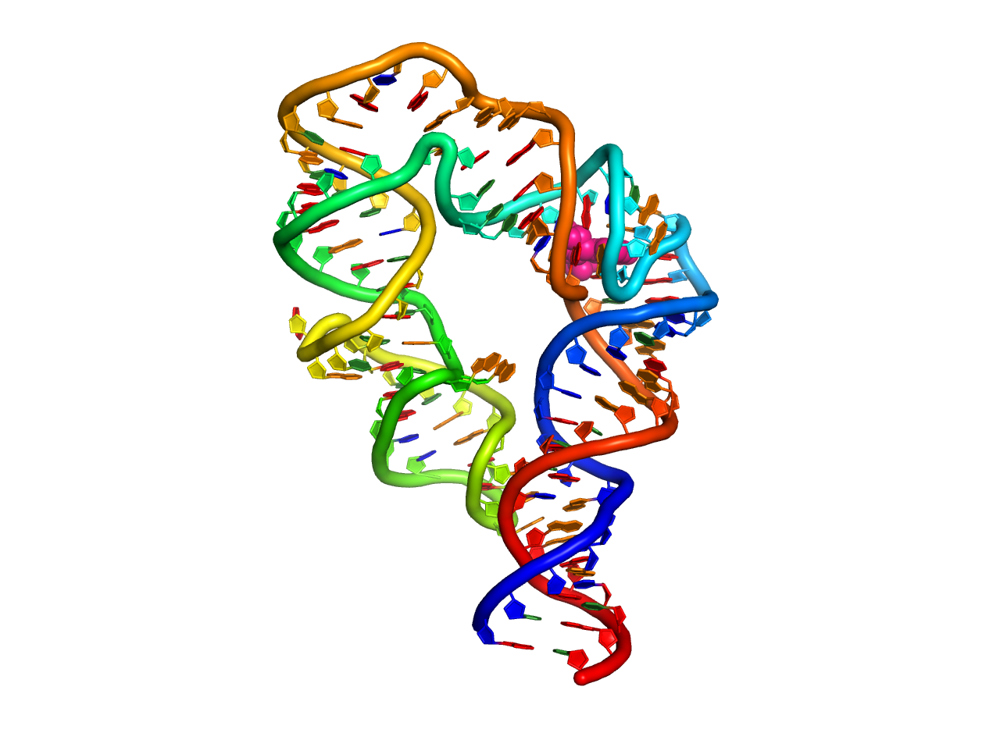

[](https://travis-ci.com/jyesselm/RNAMake)

RNAMake
=======
-----------
(c)  J.Yesselman, Stanford University, 2014-2018

**RNAMake** is a toolkit for designing and optimizing RNA 3D structure. It allows 
the alignment between RNA motifs. These motif are small modular pieces of RNA that are 
believed to fold independently, thus attaching them together with helix flanking both 
sides allows users of **RNAMake** to build large segments of RNA with a high success 
rate of forming the predicted structure _in vitro_.

Install
-------
```
git clone https://github.com/jyesselm/RNAMake.git
cd RNAMake
sudo pip install -r requirements.txt
```

Make sure to have a valid c++ compiler either g++ (> 4.6) or clang as well as python 2.7. In your .bashrc (.bash_profile if mac OSX) add:

```
# location to RNAMake directory used by RNAMake
export RNAMAKE=<RNAMake Path> 
# adding point python to RNAMake python code 
export PYTHONPATH=$PYTHONPATH:$RNAMAKE
```
[OPTIONAL] but useful

```
# location of RNAMake c++ executables 
export PATH=$PATH:$RNAMAKE/rnamake/lib/RNAMake/cmake/build/ 
# location of python executable scripts  
export PATH=$PATH:$RNAMAKE/rnamake/bin/                                                                     
```

note if you are using c shell or another non bash shell you will need to use the equivalent commands


Compile
------- 
requires `cmake` and `ninja`

cmake: https://github.com/Kitware/CMake <br>
ninja: https://github.com/ninja-build/ninja

make sure they are in your `$PATH`. Then run:

```
python compile.py 
```
executables are located in

```
$RNAMAKE/rnamake/lib/RNAMake/cmake/build/
```

Tests [OPTIONAL]
-----
To run unit tests for python:
```
$RNAMAKE/rnamake/unittests/run_unittests.sh
```

To run unit tests for C++ code:

```
cd $RNAMAKE/rnamake/lib/RNAMake/cmake/build/
python run_unittests.py
```


Applications
============
1. <a href="#design_rna">design_rna</a> 
2. <a href="#ribosome_tethering">ribosome_tethering</a> 
3. <a href="#apt_stablization">apt_stablization</a> 

<a id="design_rna"></a>
design_rna
-----------
Generates segments are RNA between two Watson-Crick basepairs can also perform sequence optimization for helical sequences. 

```
design_rna  [-pdb pdb_file.pdb ]
			[-start_bp "start_bp_name" ]
			[-end_bp "end_bp_name" ]
			[-mg motif_graph.mg ]
			[-out_file name_of_outfile.out ]
			[-score_file name_of_scorefile.scores ]
			[-designs num_of_designs ]
			[-seqs_per_design seq_per_designs ]
			[-search.accept_score accept_score]
			[-show_sections ]
			[-mc ]
			[-only_ideal]
			[-verbose ]
```
#### Required Arguments

Argument  | Description
------------- | -------------
-pdb		    | PDB file containing starting RNA, make sure that both the start basepair and end basepair are watson and crick base pairs that are end at RNA chains. Must supply both `-start_bp` and `-end_bp`. See figure below.
-start_bp			    | The Watson-Crick basepair to start building the RNA segment from. Example "A194-A252" the base pair between resiudes 192 and 252 both on chain A. 
-end_bp			 |	The Watson-Crick basepair to end the RNA segment. Same naming convention as `start_bp`. See examples below.
-mg			    | Supplies a motif graph file instead of a pdb, `start_bp` and `end_bp`; see documention for more info. 

#### Example of Basepair Ends that can be connected with `design_rna`


##Examples

examples are located: $RNAMAKE/examples/cpp/design_rna


start.pdb:


Simplest use, generating one design

```
design_rna -pdb start.pdb -start_bp A222-A251 -end_bp A149-A154 -pdbs
> DESIGN RNA: loaded pdb from file: start.pdb
> DESIGN RNA: generated 1 design(s)! if you would like more please specify how many you would like with -designs #Num
```
saved solution in: design.0.pdb


Getting more designs:

```
design_rna -pdb start.pdb -start_bp A222-A251 -end_bp A149-A154 -pdbs -designs 100
> DESIGN RNA: loaded pdb from file: start.pdb
> DESIGN RNA: generated 100 design(s)! if you would like more please specify how many you would like with -designs #Num
```

Controlling size of the solution:

```
design_rna -pdb start.pdb -start_bp A222-A251 -end_bp A149-A154 -pdbs -search.max_size 100
```


####Many more examples in $RNAMAKE/examples/cpp/design_rna/COMMANDS

<a id="ribosome_tethering"></a>
ribosome_tethering
-----------
A python script that setups up a <a href="#design_rna">design_rna</a> run to tether the two subunits of the E. coli. ribosome.

```
ribosome_tethering.py 
		   -pdb_50s "pdb path to 50s subunit"
		   -pdb_30s "pdb path to 30s subunit"
			[-cutpoint_50s "50s basepair name" ]
			[-cutpoint_30s "30s basepair name" ]
```
-cutpoint\_50s and -cutpoint\_30s work as -start\_bp and -end\_bp from design_rna: a Watson-Crick basepair, Example "A194-A252" the base pair between residues 192 and 252 both on chain A.  		
##Examples
examples are located: $RNAMAKE/examples/cpp/ribosome_tether

```
ribosome_tethering.py -pdb_50s pdbs/3R8T.pdb -pdb_30s pdbs/4GD2.pdb
>[2018-07-01 13:12:07,258] building new motif file for: pdbs/3R8T.pdb will save to reduce run time for repeat runs. Can be overrided with -rebuild
>[2018-07-01 13:13:45,325] building new motif file for: pdbs/4GD2.pdb will save to reduce run time for repeat runs. Can be overrided with -rebuild
>[2018-07-01 13:14:20,378] loading saved motif file: motifs/3R8T.motif
>[2018-07-01 13:14:21,592] loading saved motif file: motifs/4GD2.motif
>[2018-07-01 13:15:13,950] outputing start pdbs 30S.pdb and 50S.pdb
>[2018-07-01 13:15:13,950] success! COMMAND file generated. run "source COMMAND" to build tether
```


```
source COMMAND
>DESIGN RNA: generated 1 design(s)! if you would like more please specify how many you would like with -designs #Num
```


<a id="apt_stablization"></a>
apt_stablization
-----------
Generates a 3D scaffold around a given coordinates of a small-molecule binding aptamer. 

```
apt_stablization [-pdb pdb_file.pdb ]
				 [-out_file name_of_outfile.out ]
				 [-score_file name_of_scorefile.scores ]
				 [-designs num_of_designs ]
				 [-only_ideal]
```

##Examples
examples are located: /Users/jyesselm/projects/RNAMake/examples/cpp/apt_stablization


NOTE: please remove the coordinate of the ligand before running. It cause errors.

```
 apt_stablization -pdb atp_apt.pdb
```



